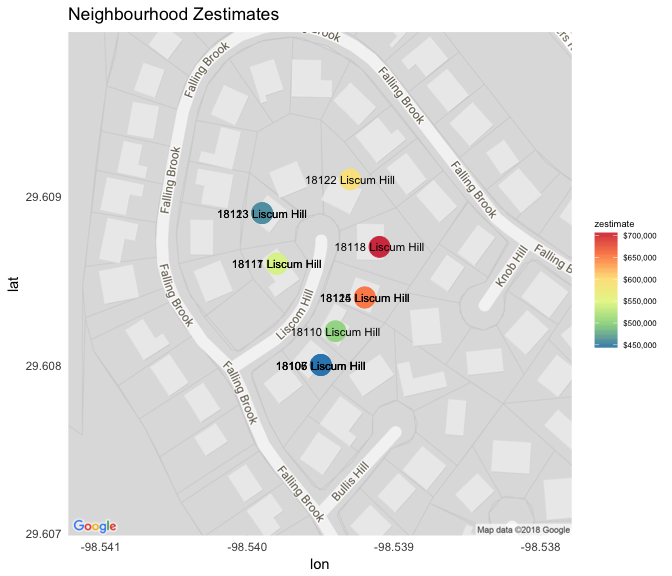
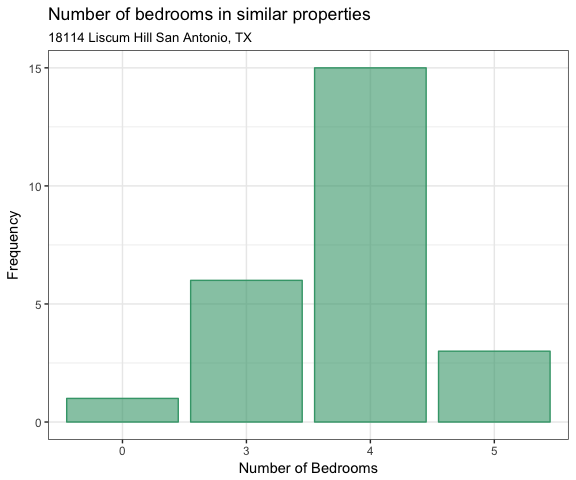
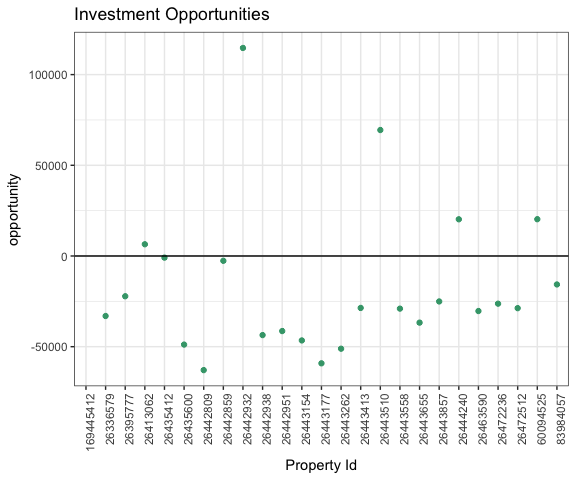

RealEstateR is a package that analyzes real estate data from the Zillow API. Zillow is a group of real estate portals containing information from properties all around the United States. Through their APIs, Zillow shares their information about their properties and some of the results of their in-house datascience models. Some of these models include:

- `Zestimate`: using all the data from their listings they can estimate the price of a particular property just knowing some of the property's features. Also, they can estimate the rent price for an specific property.

- `Comparables`: using the information from the database it's possible to find similar properties and even recommend to a customer a property that could be interesting.

The objective of the `RealEstateR` package is extracting some of the information that is available in the Zillow's API, and making it suitable for data analysis in R. In the following lines, we'll describe a typical worflow for using the `RealEstateR` package, showing how it can be integrated in to a real estate analyst/agent job.

## RealEstateR Workflow

Install RealEstateR using:

```
devtools::install_github("estebanangelm/RealEstateR")
```


After installing our package, load it using:


```r
library(RealEstateR)
```


Since the Zillow's API requires some authentication, the first thing the user should do is registering [here](http://www.zillow.com/webservice/Registration.htm) and getting a `ZWSID`, which works as the API's key. For simplicity, after getting the token it should be set up using the `set_zwsid()` function like this:

```r
set_zwsid("your_zwsid")
```


Now that we have the authentication ready, the next thing we need to do is getting the `zpid` from an address we're interested in, which is the unique id for each property in Zillow's database. So we search the address using the `get_search_results()` function and then we extract the `zpid` from it using the `get_zpid()` function:


```r
response <- get_search_results('18114 Liscum Hill', 'San Antonio', 'TX')
zpid <- get_zpid(response)
```

Note that the address must be include a street number. Passing in `"Liscum Hill"` without the street number will result in an error. 

Now that we have the `zpid` stored, we can retrieve some data and do some analysis. We can extract some individual information from the property like Zillow's price estimate:


```r
get_zestimate(zpid)
#> [1] 655704
```

For example this property has an estimated price of $655.924. We can also retrieve the exact latitude and longitude of the property if we want to check it on Google Maps:


```r
get_loc(response)
#> 
#> Status:  Request successfully processed 
#> <Zillow: http://www.zillow.com/webservice/GetSearchResults.htm?zws-id=X1-ZWz1gc6yixcsnf_a57uf&address=18114+Liscum+Hill&citystatezip=San+Antonio%2C+TX>
#> 
#> # A tibble: 1 x 6
#>     zip street          city        state latitude longitude
#>   <int> <chr>           <chr>       <chr>    <dbl>     <dbl>
#> 1 78258 18114 Liscum Hl SAN ANTONIO TX        29.6     -98.5
```

Or the links to the property's Zillow link if we want to check the photos associated to it:


```r
get_links(response)
#> 
#> Status:  Request successfully processed 
#> <Zillow: http://www.zillow.com/webservice/GetSearchResults.htm?zws-id=X1-ZWz1gc6yixcsnf_a57uf&address=18114+Liscum+Hill&citystatezip=San+Antonio%2C+TX>
#> 
#> # A tibble: 1 x 6
#>   home_details   char_data    map_this_home  similar_sales region_overview
#>   <chr>          <chr>        <chr>          <chr>         <chr>          
#> 1 https://www.z… http://www.… http://www.zi… http://www.z… http://www.zil…
#> # ... with 1 more variable: sale_by_owner <chr>
```

We can also check the price estimates of other properties in the neighbourhood. The `get_neighbour_zestimates()` function searches for zestimates of 10 street numbers greater than and less than the given property's address. If there are no neighbours on the same street, an error message will get returned. The maximum number of neighbours that could get returned is 20.


```r
neighbours <- get_neighbour_zestimates('18114 Liscum Hill', 'San Antonio', 'TX')
head(neighbours)
#>             address zestimate latitude longitude
#> 1 18115 Liscum Hill    655704  29.6084  -98.5392
#> 2 18117 Liscum Hill    542352  29.6086  -98.5398
#> 3 18118 Liscum Hill    709493  29.6087  -98.5391
#> 4 18122 Liscum Hill    591605  29.6091  -98.5393
#> 5 18123 Liscum Hill    458953  29.6089  -98.5399
#> 6 18124 Liscum Hill    655704  29.6084  -98.5392
```

You can also plot the neighbourhood price estimates using `plot_neighbour_zestimates()`. The size of each property marker corresponds to its zestimate.


```r
plot_neighbour_zestimates(neighbours)
#> Map from URL : http://maps.googleapis.com/maps/api/staticmap?center=29.608483,-98.539508&zoom=18&size=640x640&scale=2&maptype=roadmap&language=en-EN&sensor=false
```

<!-- -->

Additional to the one by one data extraction, we can also do some bulk retrieval for further analysis of a property and other comparable properties. The most detailed way of extracting data of similar properties from the database is using the `get_comp_df()` function. We input an specific `zpid` and we can decide the number of similar properties we want to get with the parameter count. For this exercise we'll get 20 of them


```r
comp_df <- get_comp_df(zpid, count = 25)
head(comp_df)
#> # A tibble: 6 x 8
#>         zpid bedrooms bathrooms  year  size lot_size   value  rent
#>        <dbl>    <dbl>     <dbl> <dbl> <dbl>    <dbl>   <dbl> <dbl>
#> 1  26435600.       4.      2.10 1979. 2977.   10018. 377412. 2300.
#> 2  26435412.       4.      3.00 1978. 2346.   10454. 273474. 1908.
#> 3 169445412.       0.     NA    2016. 2462.    8364.     NA    NA 
#> 4  26336579.       4.      3.00 1993. 2472.    6534. 318798. 2000.
#> 5  26395777.       3.      2.00 1993. 2445.   10890. 306621. 1991.
#> 6  26413062.       4.      3.00 1992. 2238.    7405. 264959. 1900.
```


```r
library(tidyverse)
ggplot(comp_df %>% group_by(bedrooms = as.factor(bedrooms)) %>% summarize(count = n()))+
  geom_col(aes(bedrooms,count),color="#40A379",fill="#40A379",alpha=0.6)+
  scale_y_continuous("Frequency")+
  scale_x_discrete("Number of Bedrooms")+
  ggtitle("Number of bedrooms in similar properties",subtitle = "18114 Liscum Hill San Antonio, TX")+
  theme_bw()
```

<!-- -->

There's a rule of thumb in real estate that a property has a rent price approximately of 0.7% of the property value. We can run a simple analysis to find opportunities of investment in similar properties that are "undervalued" from their theorical price:


```r
rule_thumb <- comp_df %>% 
                mutate(value_approx = rent/0.007,
                       opportunity = value_approx - value) %>% 
                select(zpid,opportunity)

ggplot(rule_thumb)+
  geom_point(aes(as.character(zpid),opportunity),fill="#40A379",color="#40A379")+
  geom_hline(yintercept = 0)+
  scale_x_discrete("Property Id")+
  ggtitle("Investment Opportunities")+
  theme_bw()+
  theme(axis.text.x=element_text(angle=90,hjust=1))
```

<!-- -->

We can also get information and review details for different real estate agents using their screenname (Zillow's id). First, if we don't know an agent's screenname, but have their exact name and a location where their business occupies, we can use function `reviews_get_screennames()` to get this information:


```r
reviews_get_screennames(name = 'Guy and Patrick Cagney', city = 'Cincinnati', state = 'OH')
#> [1] "Guy24"
```

Now given that we have several screennames and want to figure out which agent has highest ratings among all, we can use function `reviews()` to get this information. This function allows us to find out information of up to 5 screennames. 


```r
screennames <- c("mwalley0", "pamelarporter", "klamping4", "Cincysrealtor", "Guy24") 

review_df <- reviews(zwsid, screennames)

# this function might yield error if ZWSID is invalid, or if we have reached 1000 request limits
if (is.data.frame(review_df)){
ggplot(review_df) +
  geom_col(aes(name, negotiationskillsRating), color="#40A379", fill="#40A379", alpha=0.6) + 
  labs(title = "Negotiation Skill Comparison", subtitle = "Among 5 agents in Cincinnati, OH", caption = "Data from Zillow.com",  
       x = "", y = "Rating") + 
  theme_bw()
}
```
